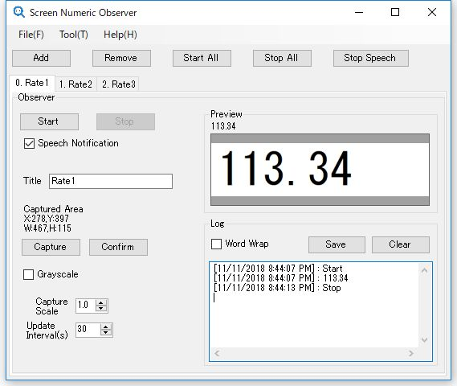

# Screen Numeric Observer

## Overview
This application observes the numeric that is on screen.

It capture the image from the specified area on screen then read numeric from it.

You can use the feature that is recording log and text-to-speech notification.

Compatible with multiple displays.

## System Requirements
Microsoft Windows 7 SP1 or later and .NET Framework 4.5.2 Runtime

## Usage
<a href="https://tkpphr.github.io/ScreenNumericObserver/Docs/manual.html">Open manual</a>

## License
Released under the Apache 2.0 License.
See LICENSE.txt File.

This application uses third-party resources.
See details at <a href="https://tkpphr.github.io/ScreenNumericObserver/Docs/notices.html">here</a>.